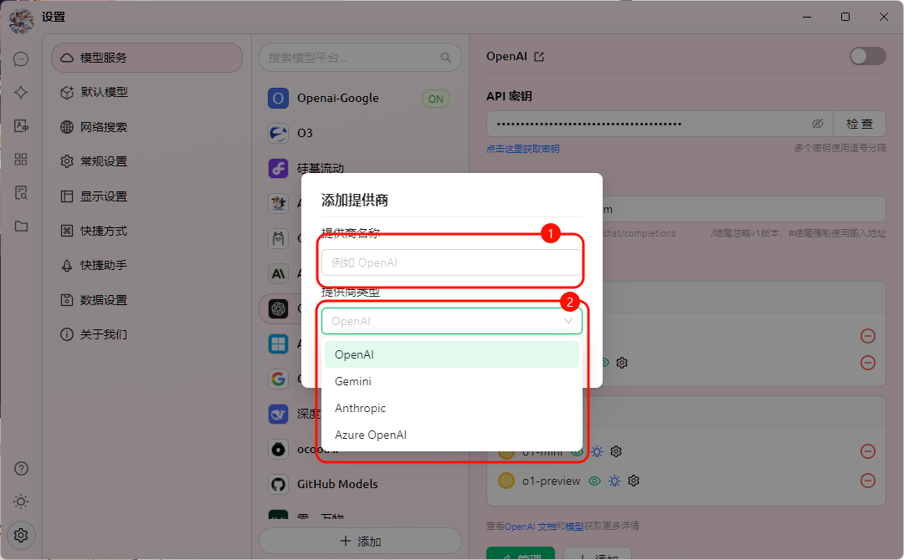
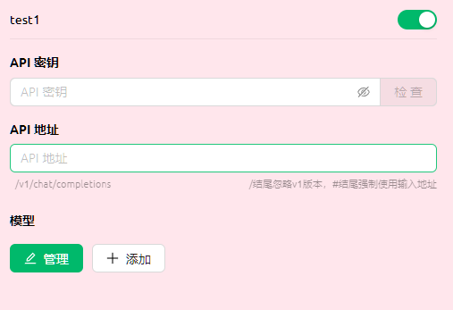
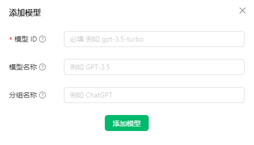

> 历史知识归档：由白云飞以 arch3rPro 账号首次发布，本次经本人授权迁移。原始发布日期：2025-04-01 22:11:20。

# 自定义服务商

Cherry Studio 不仅集成了主流的 AI 模型服务，还赋予了您强大的自定义能力。通过 **自定义 AI 服务商** 功能，您可以轻松接入任何您需要的 AI 模型。

## 为什么需要自定义 AI 服务商？

* **灵活性：** 不再受限于预置的服务商列表，自由选择最适合您需求的 AI 模型。
* **多样性：** 尝试各种不同平台的 AI 模型，发掘它们的独特优势。
* **可控性：** 直接管理您的 API 密钥和访问地址，确保安全和隐私。
* **定制化：** 接入私有化部署的模型，满足特定业务场景的需求。

## 如何添加自定义 AI 服务商？

只需简单几步，即可在 Cherry Studio 中添加您的自定义 AI 服务商：



1. **打开设置：** 在 Cherry Studio 界面左侧导航栏中，点击“设置”（齿轮图标）。
2. **进入模型服务：** 在设置页面中，选择“模型服务”选项卡。
3. **添加提供商：** 在“模型服务”页面中，您会看到已有的服务商列表。点击列表下方的“+ 添加”按钮，打开“添加提供商”弹窗。
4. **填写信息：** 在弹窗中，您需要填写以下信息：
   * **提供商名称：** 为您的自定义服务商起一个易于识别的名称（例如：MyCustomOpenAI）。
   * **提供商类型：** 从下拉列表中选择您的服务商类型。目前支持：
     * OpenAI
     * Gemini
     * Anthropic
     * Azure OpenAI
5. **保存配置：** 填写完毕后，点击“添加”按钮保存您的配置。

## 配置自定义 AI 服务商



添加完成后，您需要在列表中找到您刚刚添加的服务商，并进行详细配置：

1. **启用状态** 自定义服务商列表最右侧有一个启用开关，打开代表启用该自定义服务。
2. **API 密钥：**
   * 填写您的 AI 服务商提供的 API 密钥（API Key）。
   * 点击右侧的“检查”按钮，可以验证密钥的有效性。
3. **API 地址：**
   * 填写 AI 服务的 API 访问地址（Base URL）。
   * 请务必参考您的 AI 服务商提供的官方文档，获取正确的 API 地址。
4.  **模型管理：**

    * 点击“+ 添加”按钮，手动添加此提供商下您想要使用的模型ID。例如 `gpt-3.5-turbo`、`gemini-pro` 等。

    

    * 如果您不确定具体的模型名称，请参考您的 AI 服务商提供的官方文档。
    * 点击"管理"按钮，可以对已经添加的模型进行编辑或者删除。

## 开始使用

完成以上配置后，您就可以在 Cherry Studio 的聊天界面中，选择您自定义的 AI 服务商和模型，开始与 AI 进行对话了！

## 使用 vLLM 作为自定义 AI 服务商

vLLM 是一个类似Ollama的快速且易于使用的 LLM 推理库。以下是如何将 vLLM 集成到 Cherry Studio 中的步骤：

1.  **安装 vLLM：** 按照 vLLM 官方文档（`https://docs.vllm.ai/en/latest/getting\_started/quickstart.html`（`https://docs.vllm.ai/en/latest/getting_started/quickstart.html`））安装 vLLM。

    ```sh
    pip install vllm # 如果你使用pip
    uv pip install vllm # 如果你使用uv
    ```
2.  **启动 vLLM 服务：** 使用 vLLM 提供的 OpenAI 兼容接口启动服务。主要有两种方式，分别如下：

    * 使用`vllm.entrypoints.openai.api_server`启动

    ```sh
    python -m vllm.entrypoints.openai.api_server --model gpt2
    ```

    * 使用`uvicorn`启动

    ```sh
    vllm --model gpt2 --served-model-name gpt2
    ```

确保服务成功启动，并监听在默认端口 `8000` 上。 当然， 您也可以通过参数`--port`指定 vLLM 服务的端口号。

3. **在 Cherry Studio 中添加 vLLM 服务商：**
   * 按照前面描述的步骤，在 Cherry Studio 中添加一个新的自定义 AI 服务商。
   * **提供商名称：** `vLLM`
   * **提供商类型：** 选择 `OpenAI`。
4. **配置 vLLM 服务商：**
   * **API 密钥：** 因为 vLLM 不需要 API 密钥，可以将此字段留空，或者填写任意内容。
   * **API 地址：** 填写 vLLM 服务的 API 地址。默认情况下，地址为： `http://localhost:8000/`（如果使用了不同的端口，请相应地修改）。
   * **模型管理：** 添加您在 vLLM 中加载的模型名称。 在上面运行`python -m vllm.entrypoints.openai.api_server --model gpt2`的例子中, 应该在此处填入`gpt2`
5. **开始对话：** 现在，您可以在 Cherry Studio 中选择 vLLM 服务商和 `gpt2` 模型，开始与 vLLM 驱动的 LLM 进行对话了！

## 提示与技巧

* **仔细阅读文档：** 在添加自定义服务商之前，请务必仔细阅读您所使用的 AI 服务商的官方文档，了解 API 密钥、访问地址、模型名称等关键信息。
* **检查 API 密钥：** 使用“检查”按钮可以快速验证 API 密钥的有效性，避免因密钥错误导致无法使用。
* **关注 API 地址：** 不同的 AI 服务商和模型，API 地址可能有所不同，请务必填写正确的地址。
* **模型按需添加:** 请只添加您实际上会用到的模型, 避免添加过多无用模型.

---

本地迁移记录：`posts/software/cherrystudio/custom/README.md` · 源提交：`acf58fa03821` · [查看本地迁移说明](/knowledge#内容与来源边界)
