> 历史知识归档：由白云飞以 arch3rPro 账号首次发布，本次经本人授权迁移。原始发布日期：2025-04-01 00:00:42。

# 项目简介

---

CherryStudio 是一款集多模型对话、知识库管理、AI 绘画、翻译等功能于一体的全能 AI 助手平台。
CherryStudio 高度自定义的设计、强大的扩展能力和友好的用户体验，使其成为专业用户和 AI 爱好者的理想选择。无论是零基础用户还是开发者，都能在 CherryStudio 中找到适合自己的AI功能，提升工作效率和创造力。

### **核心功能与特色**

#### **1. 基础对话功能**

* **一问多答**：支持同一问题通过多个模型同时生成回复，方便用户对比不同模型的表现。

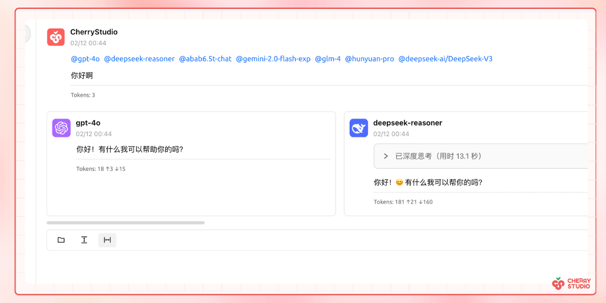

* **自动分组**：每个助手的对话记录会自动分组管理，便于用户快速查找历史对话。
* **对话导出**：支持将完整对话导出为多种格式（如 Markdown、Word 等），方便储存与分享。
* **高度自定义参数**：除了基础参数调整外，还支持用户填写自定义参数，满足个性化需求。

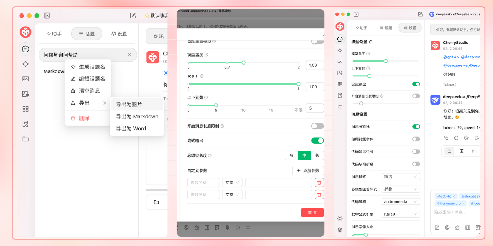

* **助手市场**：内置千余个行业专用助手，涵盖翻译、编程、写作等领域，同时支持用户自定义助手。

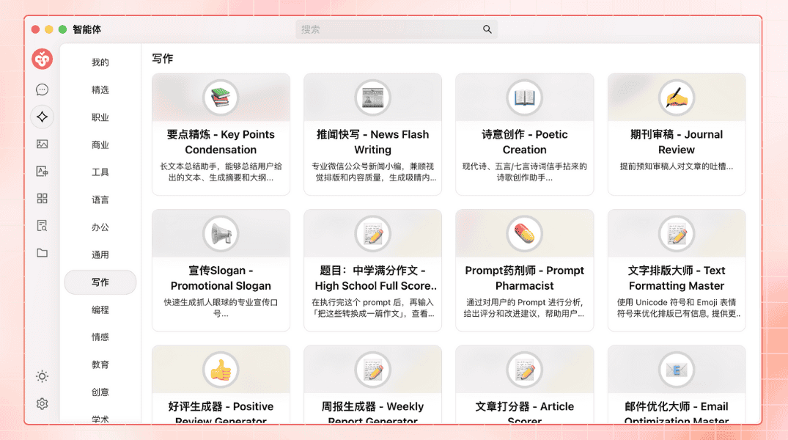

* **多种格式渲染**：支持 Markdown 渲染、公式渲染、HTML 实时预览等功能，提升内容展示效果。

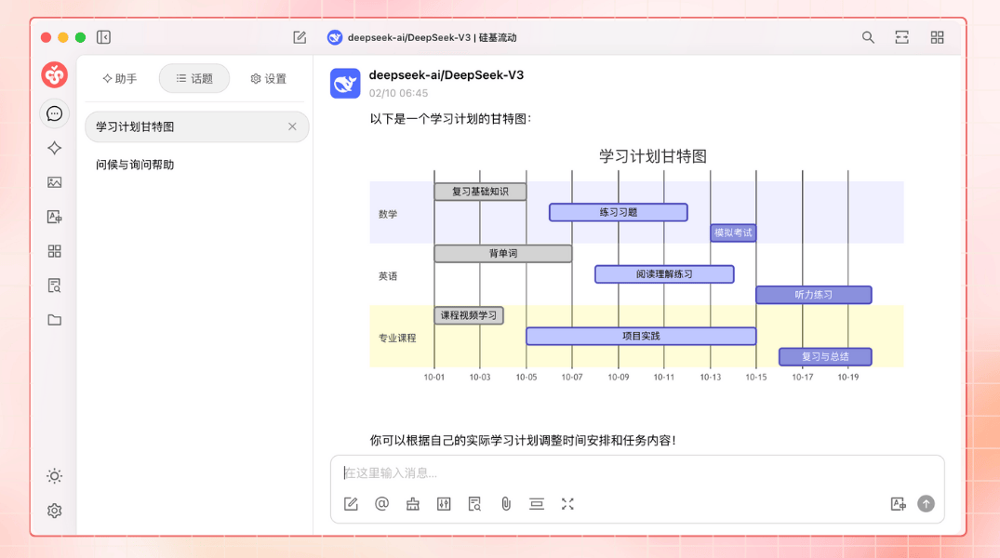

#### **2. 多种特色功能集成**

* **AI 绘画**：提供专用绘画面板，用户可通过自然语言描述生成高质量图像。

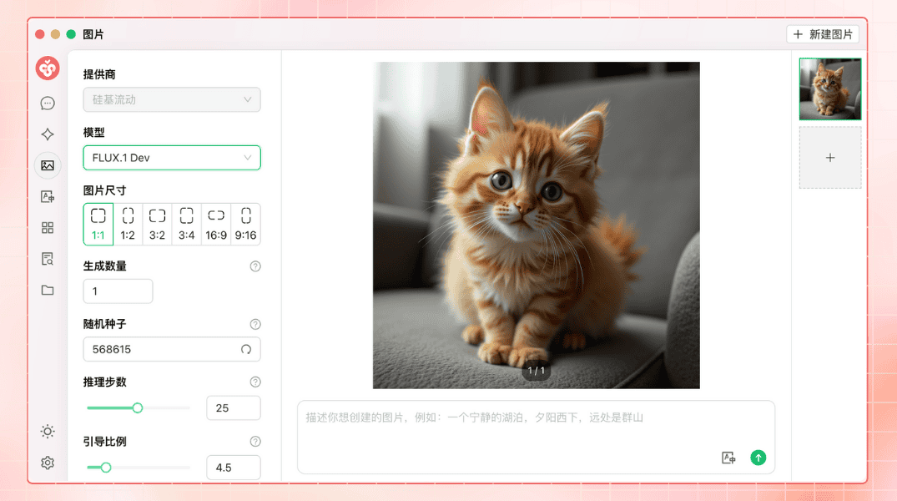

* **AI 小程序**：集成多种免费 Web 端 AI 工具，无需切换浏览器即可直接使用。
* **翻译功能**：支持专用翻译面板、对话翻译、提示词翻译等多种翻译场景。
* **文件管理**：对话、绘画和知识库中的文件统一分类管理，避免繁琐查找。

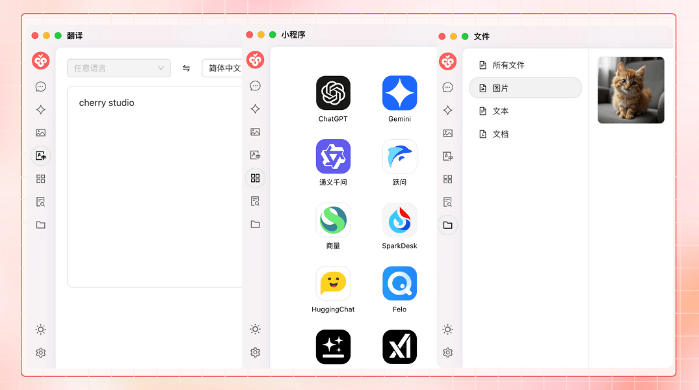

* **全局搜索**：支持快速定位历史记录和知识库内容，提升工作效率。

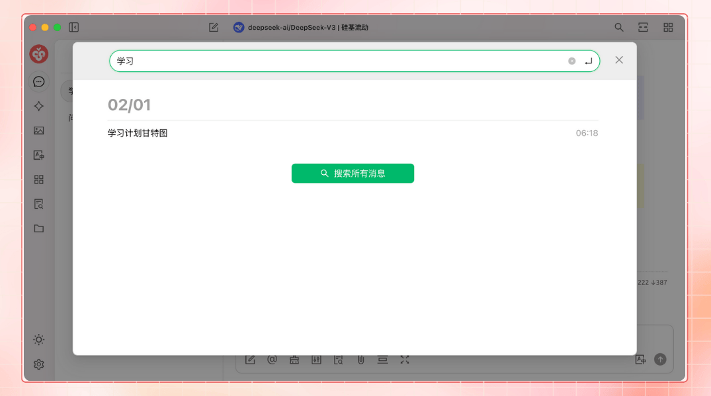

#### **3. 多服务商统一管理机制**

* **服务商模型聚合**：支持 OpenAI、Gemini、Anthropic、Azure 等主流服务商的模型统一调用。
* **模型自动获取**：一键获取完整模型列表，无需手动配置。
* **多秘钥轮询**：支持多个 API 秘钥轮换使用，避免速率限制问题。
* **精准头像匹配**：为每个模型自动匹配专属头像，提升辨识度。
* **自定义服务商**：支持符合 OpenAI、Gemini 、Anthropic等规范的三方服务商接入，兼容性强。

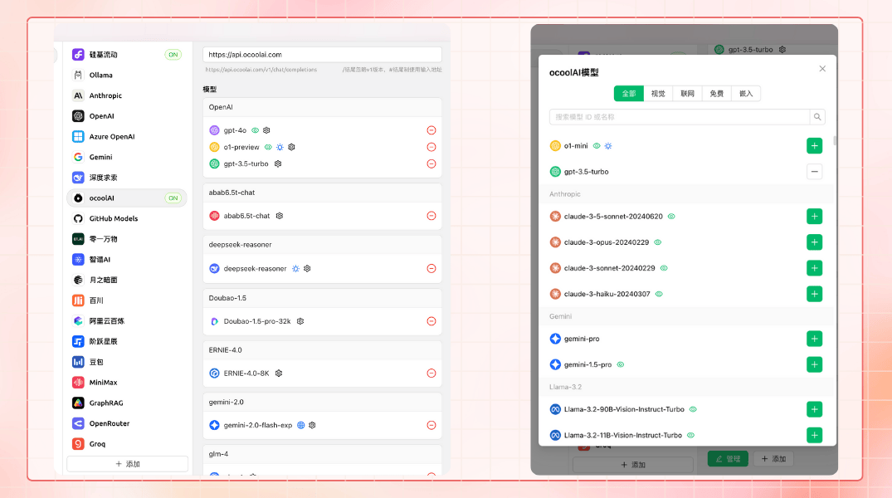

#### **4. 高度自定义界面和布局**

* **自定义 CSS**：支持全局样式自定义，打造专属界面风格。
* **自定义对话布局**：支持列表或气泡样式布局，并可自定义消息样式（如代码片段样式）。
* **自定义头像**：支持为软件和助手设置个性化头像。
* **自定义侧边栏菜单**：用户可根据需求隐藏或排序侧边栏功能，优化使用体验。

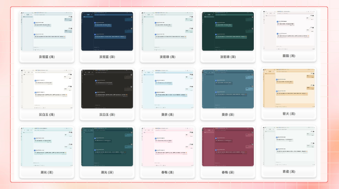

#### **5. 本地知识库系统**

* **多种格式支持**：支持 PDF、DOCX、PPTX、XLSX、TXT、MD 等多种文件格式导入。
* **多种数据源支持**：支持本地文件、网址、站点地图甚至手动输入内容作为知识库源。
* **知识库导出**：支持将处理好的知识库导出并分享给他人使用。
* **支持搜索检查**：知识库导入后，用户可实时检索测试，查看处理结果和分段效果。

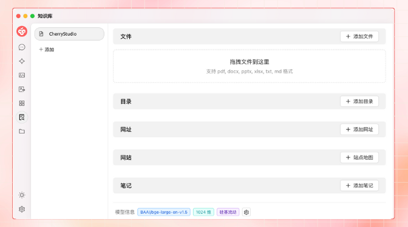

#### **6. 特色聚焦功能**

* **快捷问答**：在任何场景（如微信、浏览器）中呼出快捷助手，快速获取答案。
* **快捷翻译**：支持快速翻译其他场景中的词汇或文本。
* **内容总结**：对长文本内容进行快速总结，提升信息提取效率。
* **解释说明**：无需复杂提示词，一键解释说明不懂的问题。

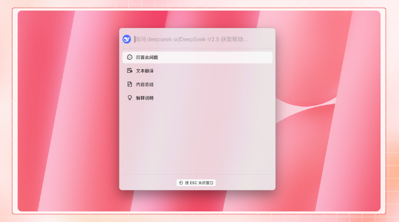

#### **7. 数据保障**

* **多种备份方案**：支持本地备份、WebDAV 备份和定时备份，确保数据安全。
* **数据安全**：支持全本地场景使用，结合本地大模型，避免数据泄漏风险。

### **项目优势**

1. **小白友好**：CherryStudio 致力于降低技术门槛，零基础用户也能快速上手，让用户专注于工作、学习或者创作。
2. **文档完善**：提供详细的使用文档和常见问题处理手册，帮助用户快速解决问题。
3. **持续迭代**：项目团队积极响应用户反馈，持续优化功能，确保项目健康发展。
4. **开源与扩展性**：支持用户通过开源代码进行定制和扩展，满足个性化需求。

### **适用场景**

* **知识管理与查询**：通过本地知识库功能，快速构建和查询专属知识库，适用于研究、教育等领域。
* **多模型对话与创作**：支持多模型同时对话，帮助用户快速获取信息或生成内容。
* **翻译与办公自动化**：内置翻译助手和文件处理功能，适合需要跨语言交流或文档处理的用户。
* **AI 绘画与设计**：通过自然语言描述生成图像，满足创意设计需求。

---

本地迁移记录：`posts/software/cherrystudio/introduce/README.md` · 源提交：`acf58fa03821` · [查看本地迁移说明](/knowledge#内容与来源边界)
